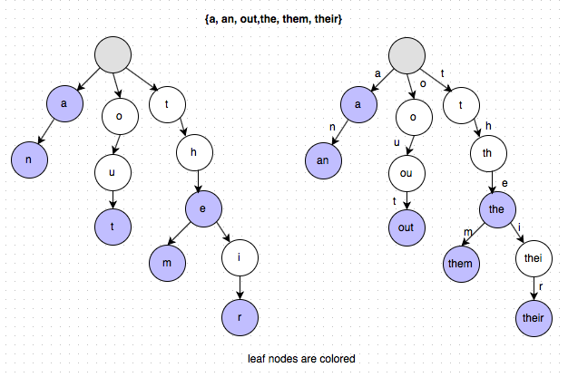

# Tries
#### by Grace Hartzell and Carrie Scott

This is our repository for learning tries to go onto teaching them to our fellow classmates. Test your understanding by...
* Fork and clone this repository
* Input answers into `trie.js` 
* Run `npm test` to check your work!
* **Only when you've completed everything or if you're desperately stuck:** Check out the `solutions` branch to see our implementation of this lovely data structure.

> Happy Coding! 
---

  

### Basic Definition
A trie is a tree that stores sequential data (e.g. words or phone numbers). Each item in the tree is a node of the tree with some nodes flagged as being potential ends of sequences. In this repository, our examples and tests will cover word storage for better understanding.

### Methods Covered
The methods that will be covered in this repository are:
1. Insertion (`insert()`)
2. Removal (`remove()`)
3. Words with Prefix (`wordsWithPrefix()`)
4. Depth First Search (`depthFirstSearch()`)
5. Breadth First Search (`breadthFirstSearch()`)

### Test Your Knowledge Elsewhere!
* ["Tries: Contacts"](https://www.hackerrank.com/challenges/ctci-contacts/problem) on HackerRank

#### Helpful Resources 
* [*Tries - javascript simple implementation* by Jonathan V.](https://medium.com/@alexanderv/tries-javascript-simple-implementation-e2a4e54e4330)
* [*Trying to Understand Tries*](https://medium.com/basecs/trying-to-understand-tries-3ec6bede0014) by Vaidehi Joshi
* [JS Algorithms](https://github.com/duereg/js-algorithms) by "duered" on Github

